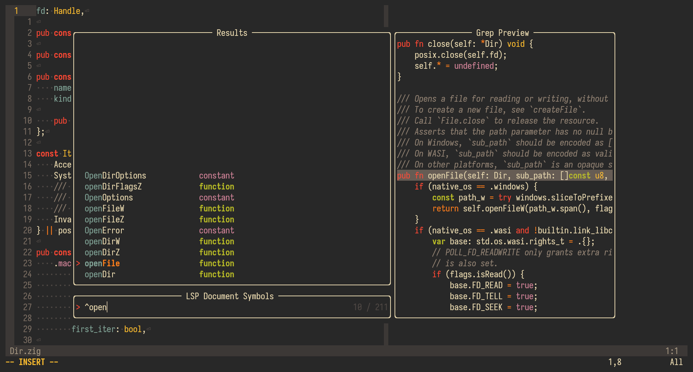

+++
title = "Why I'm disabling editor autocomplete"
date = "2024-12-22"
+++

I've been using Neovim as my text editor for over 2 years now, and I use it for
*everything*: a Personalized Development Environment
([PDE](https://www.youtube.com/watch?v=QMVIJhC9Veg)); a note-taking tool using
[Neorg](https://github.com/nvim-neorg/neorg); a log reader that handles opening,
searching, and writing very large files like a breeze; a man page reader; and so
much more.

One of the mainstays in my plugin arsenal is
[`nvim-cmp`](https://github.com/hrsh7th/nvim-cmp), which provides
*intellisense-style* autocompletion. Its collection of [completion
sources](https://github.com/hrsh7th/nvim-cmp/wiki/List-of-sources) allows
extending its functionality into many domains quite easily. It's a very useful
plugin and it worked very well for me, *and it was one of the main reasons I
switched to (and stuck with) Neovim*.

However, as time went on, I found myself using `nvim-cmp` *less* for its
intended purpose and *more* for use cases that are better solved with other
plugins and workflows. I found that in trying to *shoehorn* `nvim-cmp` into
several different tools, my overall productivity *diminished*. In this post,
I'll explain why I'm disabling `nvim-cmp` (maybe), what I'll use in its place,
and how doing so will be of benefit in the long run.

# How I use `nvim-cmp`

I realized that my main use of `nvim-cmp` was for API discovery, *especially in
languages with namespaces* (e.g. `C++`, `C#`, `Zig`). I often found myself begin
typing a line by resolving further into the namespace and paging through the
list of symbols to see if it had what I wanted. If it did, then I would accept
the suggestion and move forward; if it didn't, I would "back out" or "go up" a
level in the namespace heirarchy, and try again. Using Zig as an example:
`std.fs.<...>`, `std.fs.Dir.<...>`, `std.fs.path.<...>`... and so on, until I
found what I was looking for. Once I found it, I could continue with the next
"token" in my "stream" of conciousness.

However, if I knew *exactly* what symbol I wanted and *exactly* where to find
it, I didn't really use `nvim-cmp`. For example, using `std.debug.print` in Zig
or `std::cout` in C++ (or `printf`, even), I *rarely* relied on `nvim-cmp` for
completions. I found that it was *quicker* for me (and less disruptive) to just
type the symbol, *letter-by-letter*.

I am not the fastest typer, either. If I had to guess, I would say I type at
around 70-80 words per minute for English prose (such as this blog post,
emails--"normal" communication with other humans). That number is lower when
writing code. It's difficult to equate the two, since English prose is measured
in words per minute, whereas writing code is measured in symbols per minute
(probably.. I don't know, just a guess), which for me is probably anywhere from
20-40 percent slower [^1].

Whatever the case may be, it feels *a lot* faster to just type the exact symbol
I need instead of using `nvim-cmp` to help. Crucially, it feels *even faster* to
type the following symbol because my train of thought hasn't been *interrupted*.
For example, typing `std.deb<C-y>.pri<C-y>` feels slower than typing
`std.debug.print` (`<C-y>` is my completion-accept key).


# What will I use instead?

Of course, I still have a desire for API discoverability and documentation from
within Neovim. If `nvim-cmp` no longer provides this, *I'll need some
alternatives*. Recently, I've been giving
[Telescope](https://github.com/nvim-telescope/telescope.nvim) a heavier
workload, particularly leveraging  its
[Treesitter](https://github.com/nvim-treesitter/nvim-treesitter) integration

## Telescope

Telescope can show all symbols in a buffer or a workspace. These symbols can be
filtered through them using the familiar Telescope interface, add them to the
quickfix list, show a preview of the selection, and so on. This method for API
discoverability is *much more powerful*. Most of the time, the documentation
`nvim-cmp` shows comes from the LSP, which in turn gets it from doc-comments in
the source code [^2]. Using Telescope's preview, or even putting the result in
the quickfix list and opening the source in a new buffer allows a much better
experience to read source code and comments within it.

This leads us to my next point: *reading the source code* is often the best way
to get *accurate* and *up-to-date* documentation.



## Source code

If your language or library provides source code and you're not reading it,
*you're doing yourself a disservice*. It's often the best way to figure out what
a particular API does. More often than not, documentation in the form of
comments is *outdated*, and could lead you down a rabbit hole. Documentation
that's hosted on the web is worse, even if it is autogenerated from comments in
the code. Often times the code is updated, but the author forgets to update the
doc-comment (hi, it's me, I'm author). This is avoidable if you just *read the
code*!

This is not always an option, though. For example, the C standard library that's
installed on your distribution only provides *header files*, not
*implementations* (unless you clone the library, of course). And for languages
like C#, you actually need to *decompile* the runtime to get source code--wild.

## Grep

*Do not underestimate the power of grep*. In languages like C, it can be
difficult to navigate through header files, especially if they're nested and
inter-dependent. This is where grep makes it easy. If you're looking for a
particular symbol, or some verbiage you think may lead you to the symbol, and
you're not sure which header file it's in, you can pull one of these:
```
$ grep -ire 'IFF_NOARP' /usr/include
/usr/include/linux/if.h: * @IFF_NOARP: no ARP protocol. Can be toggled through sysfs. Volatile.
/usr/include/linux/if.h:	IFF_NOARP			= 1<<7,  /* sysfs */
/usr/include/linux/if.h:#define IFF_NOARP			IFF_NOARP
/usr/include/net/if.h:    IFF_NOARP = 0x80,		/* No address resolution protocol.  */
/usr/include/net/if.h:# define IFF_NOARP	IFF_NOARP
```

## Automatic includes

Supported language servers an also automatically include the header or namespace
that contains a symbol you're looking for. For example,
[`clangd`](https://github.com/clangd/clangd) will automatically include
`stdio.h` if it sees `printf` in your file.

All of these workflows is something `nvim-cmp` cannot provide--it is just not
designed for this.

## Man pages

Telescope also provides support for searching for man pages, and Neovim has
first-class support for rendering man pages. This makes it a breeze to find
*detailed* documentation on a topic. The information in the man pages is often
dense, but *succinct*. They may also contain links to relevant pages, which
Neovim can follow by default.

For API discoverability and documentation *that's available without an internet
connection* (or even if you don't want to open up a browser), man pages are hard
to beat. I love it when libraries and tools ship with man pages, but sadly, this
seems like a dying practice.

# Streamlining stream-of-conciousness

One of the main goals of disabling `nvim-cmp` is to *optimize* the way I approch
writing code. Instead of trying to discover an API and read its documentation
*in-band* with writing code, I want to separate the two. I want to find ways to
reduce the amount of noise and distraction while writing code. I want to know
the API *before* I use it, not get to know it *while* I'm using it.

Instead of breaking my train of thought mid-line, I should be able to plow
through it knowing *exactly* what I need. How far this goes, I'm not sure. Just
a single expression? Maybe. A whole line? Possibly. A single scope? That would
be nice. An entire function? Sweet.

I may not end up removing `nvim-cmp` entirely. There are sill some use-cases
that don't conflict with this thesis. For example, path completion is wonderful
and doesn't conflict at all with writing code.

I'm on the fence about snippets. Usually, when you need a snippet, you know
exactly what you're getting. The `std` snippet for Zig converts `std` to `const
std = @import("std");`. It's hard to make an argument that this is not a boost
in efficiency.

# Closing thoughts

In general, I see much more productivity when I can turn on some music, put my
head down, and go goblin-mode for as long as I can manage before being
interrupted by encountering an obstacle, such as needing to find just the right
function. If I can separate reading documentation from writing code, I should be
able to sustain these bouts for much longer, resulting in more productivity,
better large-scale thought cohesion, and, honestly, a more enjoyable experience.
After all, writing code should be *fun*, and reading documentation just takes the
fun right out of it.

---

[^1]: Lots of ballpark, anectdotal, pulling-it-out-my-you-know-what numbers
    here.
[^2]: There are some notable exceptions here, such as C#.
